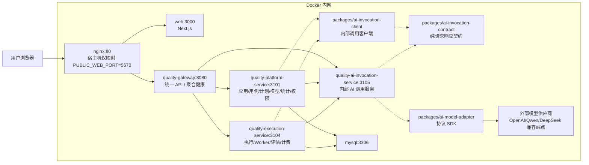

# 生产部署拓扑与开发运行标准

## 结论

QTP 运行标准分成两种模式：

- 开发环境：Node 本机进程，暴露 `3000/8080/3101/3104/3105` 便于调试；MySQL 可用 `docker-compose.dev-deps.yml` 启动。
- 生产环境：Docker Compose 全栈部署，只暴露 nginx 最终入口端口，默认 `5670:80`；web、gateway、platform、execution、AI invocation 和 mysql 都只在 Docker 网络内通信。

## 生产拓扑



## 请求边界

浏览器只知道 nginx 入口：

```text
http://服务器:5670/ai-quality-platform
```

nginx 只知道 web 和 gateway：

```text
/ai-quality-platform/api/* -> quality-gateway:8080
/ai-quality-platform/health.do -> quality-gateway:8080
其他页面资源 -> web:3000
```

gateway 才知道后端服务：

```text
business/case/plan/ai/review/statistics/system -> quality-platform-service:3101
execution -> quality-execution-service:3104
```

platform 和 execution 知道 MySQL、被测业务应用以及内部 AI 调用服务；只有 `quality-ai-invocation-service` 负责访问外部模型供应商。

AI 模型调用运行时已经抽为 `quality-ai-invocation-service`，它是 Docker 内网服务，不映射宿主机端口。platform 的供应商模型发现、模型测试和 execution 的评估调用都通过 `packages/ai-invocation-client` 发起，并只共享 `packages/ai-invocation-contract` 中的纯请求响应契约；`packages/ai-model-adapter` 作为供应商协议 SDK 只由 AI invocation 边界复用，避免业务服务各自直连外部模型供应商或间接依赖供应商协议实现。业务服务只表达 `providerKind/enableThinking/reasoningEffort` 这类抽象调用意图，且不提供 `providerOptions` 这类任意供应商字段透传口；Qwen `enable_thinking`、DeepSeek `thinking.type`、`reasoning_effort` 等供应商字段只允许在 AI invocation 边界内生成；`/models`、`/chat/completions`、`/embeddings` 等供应商 wire endpoint 也只允许在 AI invocation/adapter 边界内拼接，platform 和 execution 不回显或维护这些路径。

被测应用调用地址也按开发与生产分开治理。开发环境的 Node 进程允许调用本机和局域网测试应用，便于联调；生产 Docker 默认禁止 `localhost`、回环地址、内网 IP 和 Docker 内部服务名，避免协议测试或执行计划被配置成内网探测。确需在受控内网测试业务系统时，必须通过 `QTP_ALLOWED_APP_INVOKE_ORIGINS` 显式配置允许的 origin。

## 健康检查标准

前端健康页只请求一个聚合健康接口：

```text
GET /ai-quality-platform/health.do
```

gateway 在服务端完成内部探测：

```text
quality-gateway -> quality-platform-service/health.do
quality-gateway -> quality-execution-service/health.do
quality-gateway -> quality-ai-invocation-service/health.do
```

前端展示服务状态、数据库、Worker 等诊断结果，但不展示内部服务 URL、Docker service name 或宿主机调试端口。

## 开发运行

```bash
docker compose -f docker-compose.dev-deps.yml up -d
pnpm dev:services
pnpm dev:gateway
WATCHPACK_POLLING=true pnpm dev:web
```

开发时允许直接访问：

```text
http://127.0.0.1:3000/ai-quality-platform
http://127.0.0.1:8080/ai-quality-platform/health.do
```

这些端口只用于本机调试，不代表生产暴露面。
