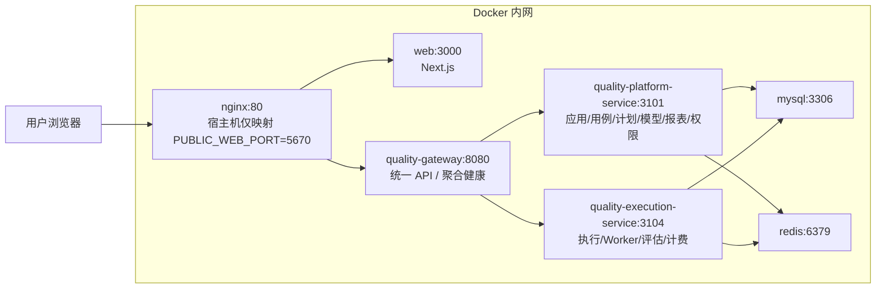

# 生产部署拓扑与开发运行标准

## 结论

QTP 运行标准分成两种模式：

- 开发环境：Node 本机进程，暴露 `3000/8080/3101/3104` 便于调试；MySQL/Redis 可用 `docker-compose.dev-deps.yml` 启动。
- 生产环境：Docker Compose 全栈部署，只暴露 nginx 最终入口端口，默认 `5670:80`；web、gateway、platform、execution、mysql、redis 都只在 Docker 网络内通信。

## 生产拓扑



## 请求边界

浏览器只知道 nginx 入口：

```text
http://服务器:5670/ai-quality-platform
```

nginx 只知道 web 和 gateway：

```text
/ai-quality-platform/api/* -> quality-gateway:8080
/ai-quality-platform/health.do -> quality-gateway:8080
其他页面资源 -> web:3000
```

gateway 才知道后端服务：

```text
business/case/plan/ai/review/statistics/system -> quality-platform-service:3101
execution -> quality-execution-service:3104
```

platform 和 execution 才知道 MySQL、Redis、外部模型供应商和被测业务应用。

## 健康检查标准

前端健康页只请求一个聚合健康接口：

```text
GET /ai-quality-platform/health.do
```

gateway 在服务端完成内部探测：

```text
quality-gateway -> quality-platform-service/health.do
quality-gateway -> quality-execution-service/health.do
```

前端展示服务状态、数据库、Redis、Worker 等诊断结果，但不展示内部服务 URL、Docker service name 或宿主机调试端口。

## 开发运行

```bash
docker compose -f docker-compose.dev-deps.yml up -d
pnpm dev:services
pnpm dev:gateway
WATCHPACK_POLLING=true pnpm dev:web
```

开发时允许直接访问：

```text
http://127.0.0.1:3000/ai-quality-platform
http://127.0.0.1:8080/ai-quality-platform/health.do
```

这些端口只用于本机调试，不代表生产暴露面。
